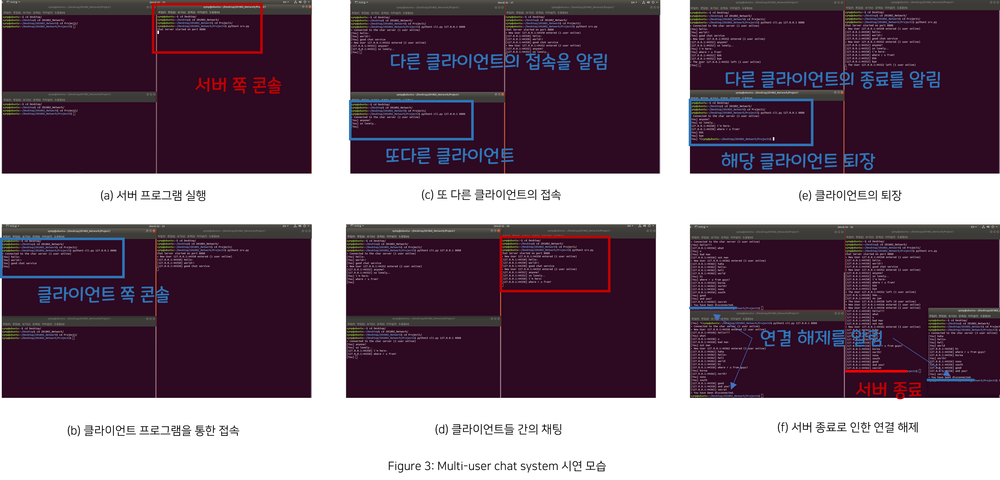
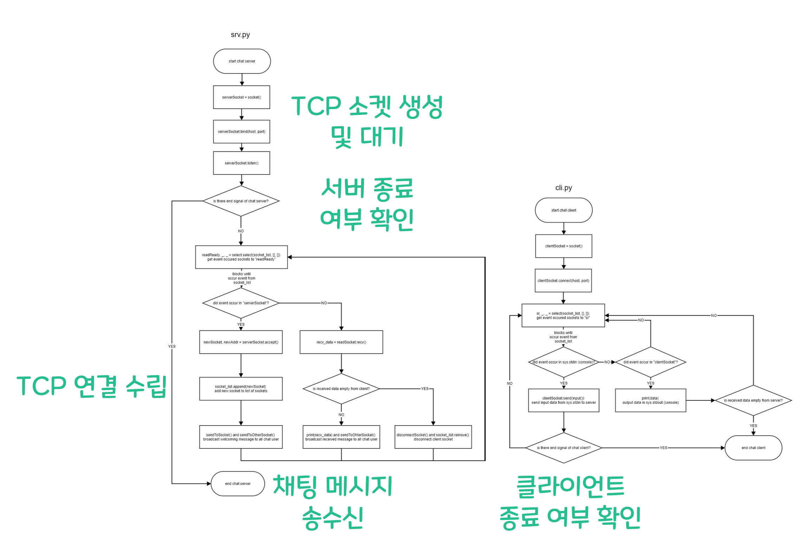

# TCP-based-Simple-Multi-user-Chat-System

TCP 소켓을 이용하여 간단하게 작동하는 채팅 시스템을 구현한 프로젝트입니다. 

# Requirement

Ubuntu 18.04+ (WSL를 사용하셔도 됩니다)

Python 3.6+

# How to use

## Server
1. srv.py 가 존재하는 디렉토리에서 "python srv.py" 명령어를 실행합니다.
2. 프로그램을 종료하고자 할때는 `ctrl+c` 키를 눌러서 KeyboardInturrupt 를 발생시키면 됩니다.

## Client  실행
1. cli.py 가 존재하는 디렉토리에서 "python cli.py [서버의 ip 주소] [서버의 port 번호]" 명령어를 실행합니다. local 에서 테스트할 경우에는 "python cli.py 127.0.0.1 8888" 명령어를 실행하면 됩니다.
2. 프로그램을 종료하고자 할때는 `ctrl+c` 키를 눌러서 KeyboardInturrupt 를 발생시키면 됩니다.

# UI

  

# Process

  

## 1. 서버 TCP 소켓 생성 및 대기
- srv.py에서 TCP 연결을 수립하기 위해 환영 소켓인 serverSocket을 만든 뒤에 listen() 메소드를 통해 해당 서버로 TCP 연결을 기다립니다. 

## 2. 서버와 클라이언트 간 TCP 연결 수립
- cli.py에서는 clientSocket을 만든 뒤에 connect() 메소드를 통해서 host와 port로 인자로 줘서 해당 서버로 TCP 연결을 수립합니다. 
- 클라이언트로부터 TCP 연결 요청이 들어오면, 서버는 해당 클라이언트와 연결되는 새로운 소켓(newSocket)을 생성하고 그 소켓을 연결된 소켓 목록(socket_list)에다가 newSocket을 추가시키고 관리합니다.

## 3. 연결된 호스트들 간의 채팅 메시지 송수신
- TCP 연결이 수립된 후부터, 새로운 클라이언트가 입장했을 때 서버는 자신의 콘솔창과 연결된 모든 클라이언트들에게 입장 메시지를 전달합니다. 
- 또한 클라이언트가 채팅을 할 때마다 서버가 이를 받아서 자신의 콘솔창과 자신과 연결된 모든 클라이언트(메시지를 보낸 클라이언트는 제외)들에게 그 메시지를 전달합니다. 

## 4. 서버와 클라이언트 종료 여부 확인
- 연결된 클라이언트 중 하나가 종료될때는 서버에게 비어 있는 메시지를 보내며, 연결된 소켓 목록에서 해당 클라이언트를 지우고 서버 콘솔창과 남은 클라이언트들에게 해당 클라이언트의 연결이 해제되었음을 알립니다.
- 한편 서버가 종료될 경우에는 연결된 모든 클라이언트들에게 비어 있는 메시지를 보내서 서버가 종료되었다는 것을 알려주며, 서버가 종료되었다는 것을 알게 된 클라이언트들은 이어서 자신을 종료합니다.

